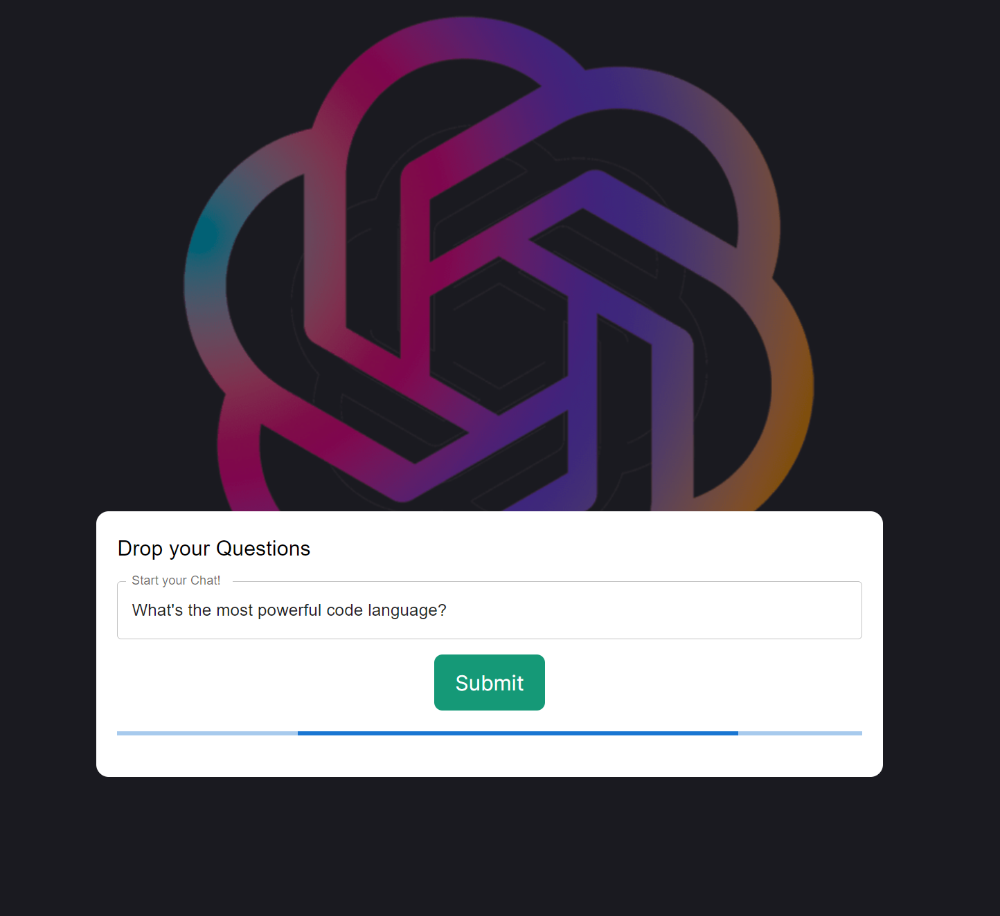
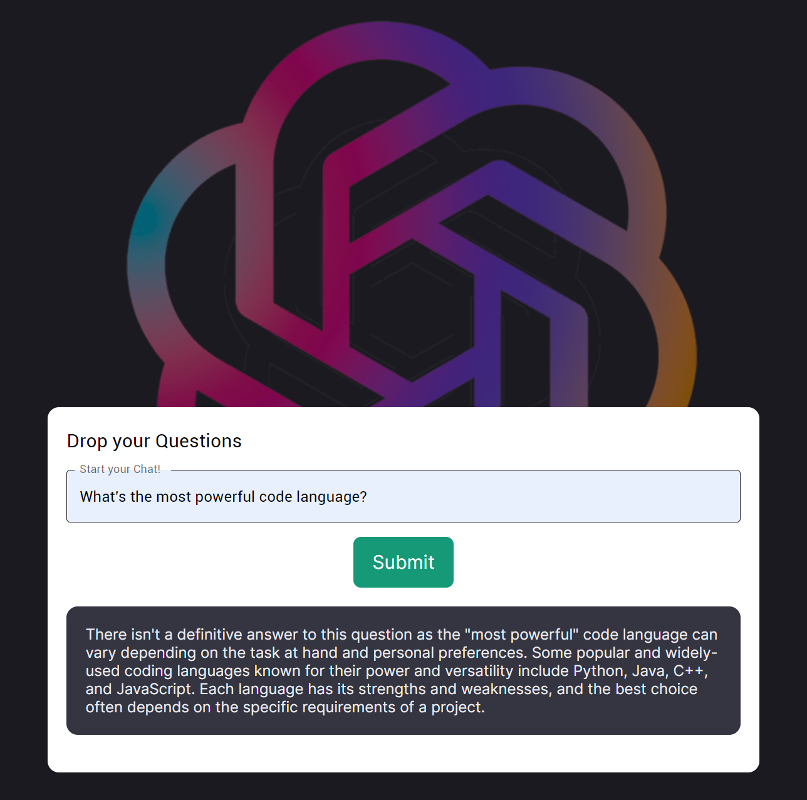

# Local ChatGPT

This program creates a local chatgpt for personal usage by calling the official openai api of "gpt-3.5 turbo". You can download this program to modify by yourself and study together!

The main tech stacks:

- Back end: JavaScript & Node.js
- Front end: React

_Note: If you want to download and try by yourself, please replace the "OPENAI_API_KEY" in the file ".env" with your own openai key first!_

- Front-end interface

  

- Loading

  

- Show the answer

  
